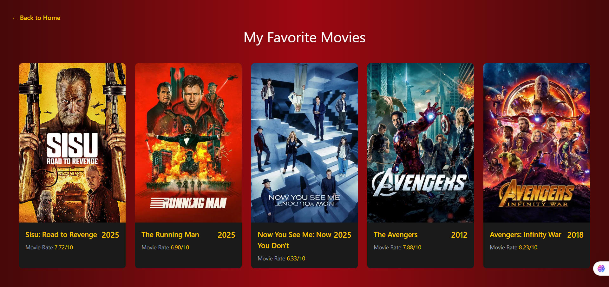
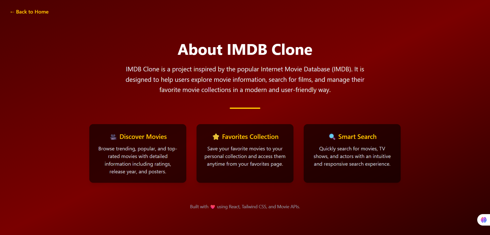
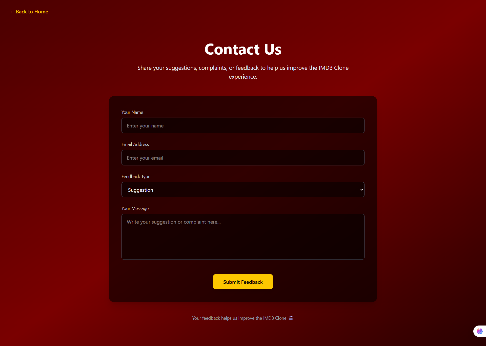
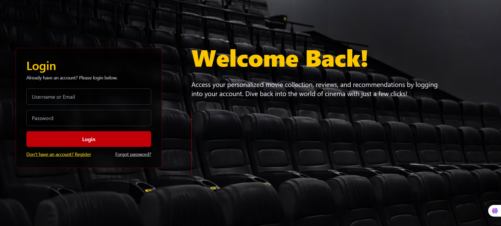
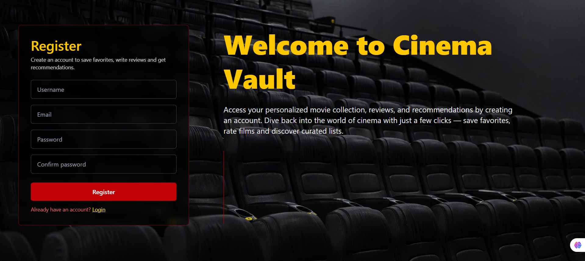

# 🎬 IMDB Clone

A modern **IMDB-inspired movie web application** built with **React, TypeScript, and Vite**, featuring a cinematic UI, movie browsing, favorites management, and user feedback functionality.

---

## 📌 Project Overview

**IMDB Clone** is a frontend-focused web application inspired by the Internet Movie Database (IMDB).  
The goal of this project is to demonstrate modern frontend development practices, clean project architecture, and a visually appealing user interface.

Users can:
- Explore movie information
- Search for movies, TV shows, and actors
- Add and manage favorite movies
- Submit suggestions or complaints via a feedback form
- Experience a cinema-style dark-themed UI

This project is ideal for **learning, practice, and portfolio presentation**.

---

## 🌐 Live Demo

> 🔗 **Live URL: [IMDB Clone](https://imdb-clone-sigma-beige.vercel.app/)

---

## 📸 Screenshots


### 🏠 Home Page


### ⭐ Favorite Movies Page


### ℹ️ About Page


### 📬 Contact / Feedback Page


### Login Page


### Register Page


### Explorer Page


# 🚀 Features
- 🎥 Movie browsing interface
- 🔍 Search movies, TV shows
- ⭐ Favorite movies collection
- 📬 User feedback (suggestions & complaints)
- 🎨 Cinematic IMDB-style UI
- 📱 Fully responsive design
- ✅ Form validation with Formik & Yup
- 🧭 Client-side routing

# 🛠️ Tech Stack
## Frontend Technologies
- React 19
- TypeScript
- Vite
- Tailwind CSS
- React Router DOM
- Formik
- Yup
- Axios
- Lucide React Icons
- JWT Decode

## Development Tools
- ESLint
- TypeScript ESLint
- Vite React Plugin
- Brower Tools (React Components, lighthouse)


# 📁 Project Structure

```bash
IMDB-CLONE/
│
├── node_modules/          # Installed dependencies
├── public/                # Static public assets
│
├── src/
│   ├── assets/            # Images, icons, and static media
│   ├── components/        # Reusable UI components
│   ├── context/           # React Context (Auth, global state)
│   ├── pages/             # Pages (Home, Favorites, About, Contact)
│   ├── services/          # API calls & Axios services
│   ├── types/             # TypeScript type definitions
│   ├── utils/             # Helper and utility functions
│   │
│   ├── App.tsx            # Root application component
│   ├── main.tsx           # Application entry point
│   └── index.css          # Global styles
│
├── .env                   # Environment variables
├── .gitignore             # Git ignored files
├── eslint.config.js       # ESLint configuration
├── index.html             # HTML template
├── package.json           # Project metadata & dependencies
├── package-lock.json      # Dependency lock file
├── README.md              # Project documentation
├── tsconfig.json          # TypeScript configuration
├── tsconfig.app.json      # App-specific TS config
├── tsconfig.node.json     # Node-specific TS config
└── vite.config.ts         # Vite configuration
```

## 🧪 Form Validation

### The Contact page uses:
- Formik for form state management
- Yup for schema-based validation

### Validation includes:
- Required fields
- Email format validation
- Minimum message length
- Feedback type selection


# ⚙️ Installation & Setup
```bash
# Clone the repository
git clone https://github.com/your-username/imdb-clone.git

# Navigate into the project directory
cd imdb-clone

# Install dependencies
npm install

# Start development server
npm run dev
```


# 🤝 Contributing

### Contributions are welcome!
- Fork the repository
- Create a new branch (Ex: feat/branch-name)
- Make your changes
- Submit a pull request


# 📄 License

This project is created for educational and portfolio purposes only.
All movie data and images belong to their respective owners.

# 👨‍💻 Author

## Eranga Madhushan(EM956)
### Full-Stack Developer
####  React | NodeJS | Express | NextJS | TypeScript | 
#### UI Enthusiast

📧 [erangamadhushann956@gmail.com]('erangamadhushann956@gmail.com')

🔗 GitHub [Erangamadhushan]('https://github.com/Erangamadhushan')
